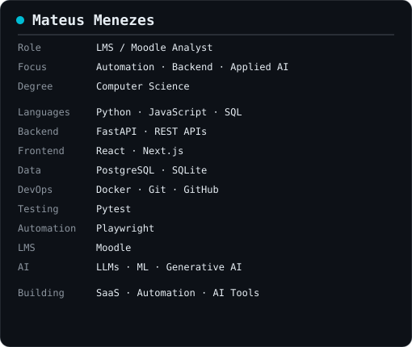

<div align="center">

# Mateus Menezes

`LMS / Moodle Analyst` · `Python Automation` · `Backend` · `Applied AI`

<picture>
  <source media="(prefers-color-scheme: dark)" srcset="./assets/heatmap-dark.svg">
  <source media="(prefers-color-scheme: light)" srcset="./assets/heatmap-light.svg">
  
</picture>

</div>

```sh
mateus@github:~$ whoami
```

<table>
  <tr>
    <td valign="top">
      <picture>
        <source media="(prefers-color-scheme: dark)" srcset="./assets/boot-card-dark.svg">
        <source media="(prefers-color-scheme: light)" srcset="./assets/boot-card-light.svg">
        
      </picture>
    </td>
    <td valign="top">
      <picture>
        <source media="(prefers-color-scheme: dark)" srcset="./assets/info-dark.svg">
        <source media="(prefers-color-scheme: light)" srcset="./assets/info-light.svg">
        
      </picture>
    </td>
  </tr>
</table>

```sh
mateus@github:~$ ls ./projects
```

### 01 — Moodle Automation

`Python` · `Playwright` · `Moodle`

Automation for repetitive LMS operations: users, courses, enrollments, groups, reports, and academic workflows. Built around practical educational processes, data handling, and reducing manual work.

### 02 — DoraVet AI Assistant

`FastAPI` · `SQLite` · `WhatsApp Cloud API` · `Conversational logic`

Conversational assistant for a veterinary business, covering customers and pets, appointment requests, service information, and human handoff. Designed with conversation state, idempotency, triage without diagnosis, and WhatsApp integration.

### 03 — Football Value AI

`Python` · `FastAPI` · `PostgreSQL` · `SQLAlchemy` · `Next.js` · `ML` · `Docker`

Football analytics platform for estimating fair odds, expected value, and opportunities through statistical modelling. Includes Poisson and Elo models, logistic regression, calibration, temporal data, backtesting, data validation, caching, rate limiting, and circuit breaking.

### 04 — Completion Detective

`Next.js` · `React` · `TypeScript` · `Moodle Web Services` · `PDF/CSV`

Moodle auditing and reporting platform for locating course-completion issues and generating professional reports, joining LMS expertise with web development, API integration, and analysis automation.

```sh
mateus@github:~$ cat experience.txt
```

```text
2023 ─────────────────────────────────────────────────────── Present

Educational technology / LMS
  Moodle operations · Python automation · Playwright
  User and course management · reporting · data processing
  Educational technology workflows
```

```sh
mateus@github:~$ ./contact.sh
```

GitHub · [@MateusMenezes02](https://github.com/MateusMenezes02)

<!--
Setup: place a portrait at source/profile.jpg, then run:
  pip install -r scripts/requirements-photo.txt
  python scripts/prep_photo.py source/profile.jpg source/prepared.png
  python scripts/make_ascii_svg.py source/prepared.png

For contribution data, run:
  GITHUB_USERNAME=MateusMenezes02 python scripts/fetch_contributions.py
  python scripts/render_heatmap_svg.py
-->
